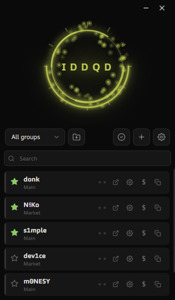
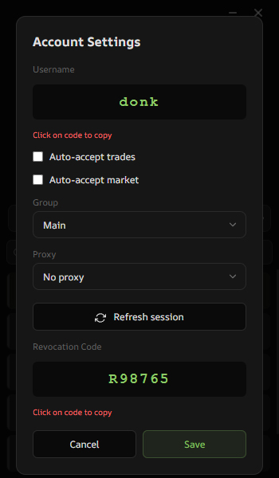
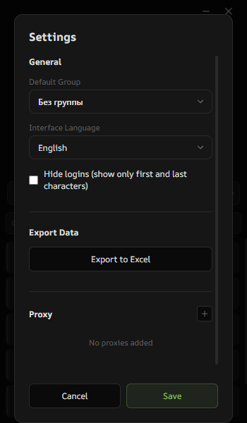
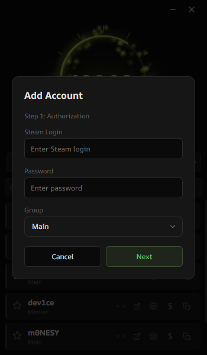

# ASDA - Awakened Steam Desktop Authenticator

Modern desktop authenticator for Steam with advanced features for managing multiple accounts, trades, and market operations.



## Features

### 🔐 Authentication & Security
- **Steam Guard 2FA** - Generate time-based authentication codes
- **Multiple accounts** - Manage unlimited Steam accounts
- **Session management** - Automatic session refresh with RefreshToken
- **Encrypted storage** - Secure storage of account credentials
- **Proxy support** - Global and per-account proxy configuration with authentication

### 📊 Account Management
- **Groups** - Organize accounts into custom groups
- **Favorites** - Quick access to frequently used accounts
- **Search** - Fast account search by username
- **Bulk operations** - Export accounts to Excel with balances
- **Account settings** - Configure proxy, group, and auto-confirmation per account



### 💰 Wallet & Balance
- **Real-time balance** - Check Steam Wallet balance for any account
- **Multi-currency** - Support for 30+ currencies
- **Automatic refresh** - Session auto-refresh when checking balance
- **Balance export** - Export all balances to Excel

### 🤝 Trade Management
- **Trade confirmations** - Accept/decline trade offers
- **Auto-confirmation** - Automatic trade confirmation (configurable)
- **Trade history** - View incoming and outgoing trades
- **Bulk actions** - Accept/decline multiple trades at once

### 🛒 Market Operations
- **Market listings** - View and manage your market listings
- **Quick cancel** - Cancel listings with one click
- **Sales history** - Track your market sales
- **Auto-confirmation** - Automatic market listing confirmation

### ⚙️ Advanced Features
- **Multi-language** - English and Russian interface
- **Auto-confirmation service** - Background service for automatic confirmations
- **Async logging** - High-performance logging with rotation
- **Modern UI** - Clean, responsive interface with animations
- **Easter eggs** - Hidden features for retro gamers 🎮



## Technical Stack

- **.NET 8.0** - Modern C# with Windows Forms
- **WebView2** - Chromium-based UI rendering
- **SteamKit2** - Steam protocol implementation
- **Protobuf** - Efficient binary serialization
- **Newtonsoft.Json** - JSON processing

## Installation

### Requirements
- Windows 10/11
- .NET 8.0 Runtime
- WebView2 Runtime (usually pre-installed)

### Quick Start

1. Download the latest release
2. Extract to any folder
3. Run `SteamGuard.exe`
4. Click "Add Account" to import your first account



### Adding Accounts

**Method 1: Import .maFile**
- Click "Add Account" → "Import"
- Select your `.maFile` from SDA/WinAuth
- Account will be imported with all settings

**Method 2: New Account**
- Click "Add Account" → "New"
- Enter Steam login and password
- Complete 2FA setup (email/SMS code)
- Save revocation code in a safe place

## Configuration

### Global Settings
- **Language** - Interface language (English/Russian)
- **Default Group** - Group for new accounts
- **Auto 2FA** - Automatic code input
- **Hide Logins** - Privacy mode for screenshots
- **Proxy Settings** - Configure global proxy

### Account Settings
- **Group** - Assign to group
- **Proxy** - Account-specific proxy
- **Auto-confirmation** - Enable/disable per account
- **Password** - Store for automatic session refresh

### Proxy Configuration

Supports HTTP/HTTPS/SOCKS5 proxies with authentication:

```
Format: host:port
Example: 192.168.1.1:8080

With auth: username:password@host:port
Example: user:pass@proxy.example.com:8080
```

## Project Structure

```
ASDA/
├── Core/                    # Core Steam functionality
│   ├── SteamAuth.cs        # Steam authentication
│   ├── SteamAuthProtos.cs  # Protobuf definitions
│   └── SteamHttpClientFactory.cs
├── Services/               # Business logic services
│   ├── WalletService.cs    # Wallet operations
│   ├── SteamServices.cs    # Trade & Market
│   ├── ConfirmationService.cs
│   └── AutoConfirmationService.cs
├── Models/                 # Data models
│   ├── SteamSession.cs
│   ├── Confirmation.cs
│   └── AppSettings.cs
├── Utils/                  # Utilities
│   ├── Logger.cs           # Async logging
│   ├── CryptoHelper.cs     # Encryption
│   └── ProxyResolver.cs    # Proxy handling
└── wwwroot/               # Web UI
    ├── index.html         # Main interface
    └── i18n.js           # Localization
```

## Logging

Application logs are stored in `logs/` directory:
- **Format**: `app_YYYYMMDD.log`
- **Rotation**: Automatic at 10 MB
- **Retention**: 7 days (configurable)
- **Levels**: Debug, Info, Warn, Error

Example log entry:
```
[2026-04-16 19:26:41.016] [Info ] [T1] [MainForm] Application started
[2026-04-16 19:26:41.065] [Debug] [T1] Loaded account s1mple, SteamId: 76561198000000001
```

## Security Notes

⚠️ **Important Security Information**

- Store your `.maFile` backups securely
- Never share your `revocation_code` - it's your recovery key
- Use strong passwords for accounts
- Enable proxy if accessing from restricted regions
- Keep the application updated

## Building from Source

```bash
# Clone repository
git clone https://github.com/iMoorich/AwakenedSteamDesktopAuthenticator.git
cd AwakenedSteamDesktopAuthenticator

# Build
dotnet build SteamGuard.csproj

# Run
dotnet run
```

## Contributing

Contributions are welcome! Please feel free to submit pull requests.

## License

This project is provided as-is for educational purposes.

## Disclaimer

This software is not affiliated with or endorsed by Valve Corporation. Use at your own risk. The developers are not responsible for any account issues, bans, or data loss.

## Credits

- Built with modern .NET technologies
- Uses SteamKit2 for Steam protocol
- Inspired by classic Steam Desktop Authenticator

---

**Made with ❤️ for the Steam community**
